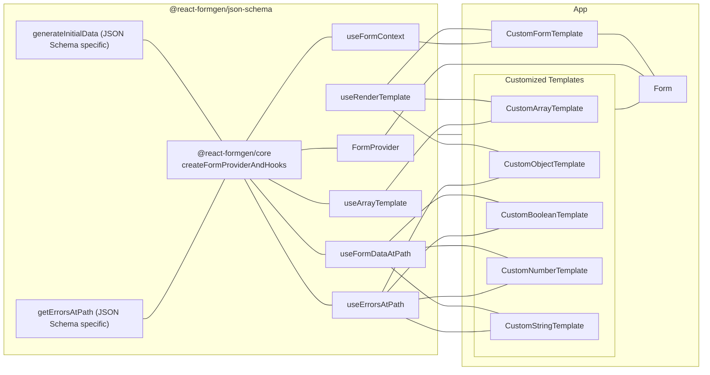

# React FormGen

## A headless, type-safe, customizable, and super simple React form generator. Turn your schemas into forms with ease.

### Quick Links

`@react-formgen/core` - Core architecture for building schema-based form generators in React ([npm](https://www.npmjs.com/package/@react-formgen/core) • [source](https://github.com/m6io/react-formgen/blob/main/packages/core/README.md))

`@react-formgen/json-schema` - JSON Schema implementation for react-formgen ([npm](https://www.npmjs.com/package/@react-formgen/json-schema) • [source](https://github.com/m6io/react-formgen/tree/main/packages/json-schema/README.md))

`@react-formgen/yup` - Yup schema implementation for react-formgen ([npm](https://www.npmjs.com/package/@react-formgen/yup) • [source](https://github.com/m6io/react-formgen/tree/main/packages/yup/README.md))

`@react-formgen/zod` - Zod schema implementation for react-formgen ([npm](https://www.npmjs.com/package/@react-formgen/zod) • [source](https://github.com/m6io/react-formgen/tree/main/packages/zod/README.md))

### Motivation

Forms are not fun to write. They are repetitive, error-prone, and time-consuming. This library aims to make form generation as simple as possible.

The packages in this repository are designed to be un-opinionated, flexible, modular, and highly customizable.

There are two types of packages in this repository:

1. **Core package**: This package (`@react-formgen/core`) provides the core functionality for the schema-based packages. This package is not really meant to be used directly, but rather as a dependency for the schema-based packages. It serves as a "factory" for creating form providers and hooks that are schema-specific. Think of it as a "scaffolding" for the schema-based form generators.
2. **Schema-based packages**: These packages take a schema (e.g., JSON Schema, Yup schema, Zod schema, etc.) and generate forms based on that schema. The schema-based packages are meant to be used directly in your projects.

### How it Works

Take, for example, the JSON Schema package (`@react-formgen/json-schema`). This package takes a JSON Schema and generates a form based on that schema. The package provides a set of hooks and a provider that you can use in your components to generate forms and/or read-only data views.

Here's a visual representation of the core and schema-based package interaction:



You can consume the JSON Schema package directly in your project, and customize the templates to suit your needs.

### Customization

The schema-based packages are designed to be highly customizable. You can extend them by:

- Customizing the **Form Root Template** (e.g., for custom form submission logic, root-level layout and beavior customization, etc.).
- Customizing the **Property Templates** (e.g., how string, number, boolean, array, and object fields are rendered).
- Overriding the **Template Renderer** (e.g., for customizing how schemas are parsed and rendered per subschema).

### Available Packages

- **@react-formgen/core**: Core package that provides the foundational form management logic.
- **@react-formgen/json-schema**: JSON Schema-based form generator.
- **@react-formgen/yup-schema** Yup-based form generator.
- **@react-formgen/zod-schema** Zod-based form generator.

### Key Features

- **Headless**: No imposed UI or styling. You are free to define how the forms are rendered.
- **Type-safe**: Strongly typed APIs and hooks that ensure schema and form data compatibility.
- **Customizable**: Define your own templates for form fields and/or data views.
- **Unopinionated**: The library does not enforce any specific schema validation library or approach, making it highly flexible.
- **Zustand for State Management**: Leverages Zustand, a small, fast, and scalable state-management library.

### Example

Here is a quick example of how to use the JSON Schema package to generate a form:

```tsx
import React from "react";
import { Form } from "@react-formgen/json-schema";
import mySchema from "./mySchema.json";

const MyFormComponent = () => {
  const handleSubmit = (data) => {
    console.log("Form submitted with data:", data);
  };

  const handleErrors = (errors) => {
    console.error("Form submission errors:", errors);
  };

  return (
    <Form
      schema={mySchema}
      onSubmit={handleSubmit}
      onError={handleErrors}
      initialData={{}} // Optional initial form data
    />
  );
};

export default MyFormComponent;
```

### Getting Started

1. Install the schema package you want to use:

```bash
npm install @react-formgen/json-schema
```

or

```bash
yarn add @react-formgen/json-schema
```

or

```bash
pnpm add @react-formgen/json-schema
```

2. Provide a JSON Schema to the `Form` component. You can do this by importing a JSON file, defining the schema directly in your component, fetching it from an API, etc.

```tsx
import mySchema from "./mySchema.json";
```

3. Use the `Form` component to generate a form based on the schema:

```tsx
<Form schema={mySchema} onSubmit={handleSubmit} onError={handleErrors} />
```

For a read-only view, just pass the `readonly` prop to the `Form` component:

```tsx
<Form schema={mySchema} readonly />
```

That's it! You now have a form generated based on your JSON Schema.

Obviously, this is a very basic example. You should customize the templates and to suit your needs.

## Contributing

Contributions are welcome. Please open an issue or submit a pull request on the GitHub repository.

## License

This project is licensed under the MIT License. See the LICENSE file for details.
